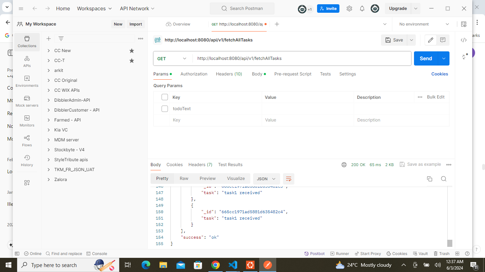
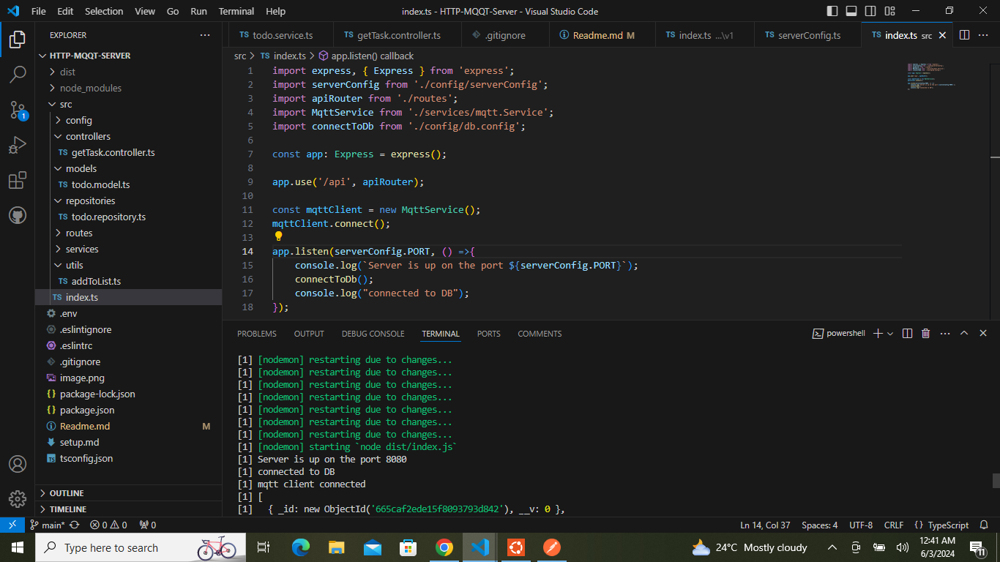

.env file is pushed to git to make it easier for the  assessing the task 

command to run : npm run dev

Tasks Implemented
1. Add new items to the list by sending a message to /add topic of the
MQTT Broker
2. Store the items as a stringified Array in a Redis Cache with a single key
called FULLSTACK_TASK_<YOUR_FIRST_NAME>
3. If there are more than 50 items in the cache, move them to a MongoDB
Collection and flush them from the Cache
4. Retrieve all items in the list through /fetchAllTasks endpoint of a HTTP
API

can use this link http://mqtt-client.emqx.com/#/recent_connections/9566a6ff-7e42-4b18-a925-3a0c5bee7560
to check if mqtt is listening to the message event. 

SAMPLE OUTPUT
Screenshot of /fetchAllTasks API

Screenshot of terminal showing server connected to DB and mqtt client

